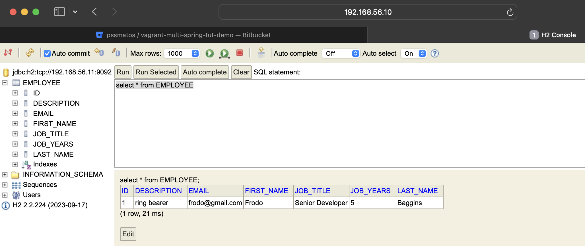

# CA3 Part 2 - Vagrant Environment Setup for Spring Boot Application

## Overview

This part of the assignment involves setting up a virtual environment using Vagrant to run the Spring Boot "basic" application developed in CA2, Part 2.
The setup includes two virtual machines (VMs): one for running Tomcat with the Spring Boot application and another for running the H2 database server.

## Steps

### 1. Initial Solution

The initial Vagrant configuration is based on the repository at https://bitbucket.org/pssmatos/vagrant-multi-spring-tut-demo/.
This configuration is a starting point that provides the necessary setup for creating and provisioning the two VMs.

### 2. Vagrantfile Study

The `Vagrantfile` from the initial solution is studied to understand how it creates and provisions the two VMs:
- `web`: This VM is configured to run Tomcat and the Spring Boot "basic" application.
- `db`: This VM is for executing the H2 server database.

For students with MacBooks that have M1/M2 chips, special considerations are noted in the `readme.md` to ensure compatibility.

### 3. Vagrant Environment Setup

Install Vagrant
```bash
brew install vagrant
```

Install QEMU/libvirt (even if you have UTM installed)
```bash
brew install qemu
brew install libvirt
```
Install vagrant from Hashicorp tap (preferred over community version)
```bash
brew install hashicorp/tap/hashicorp-vagrant
```

Install vagrant provider vagrant-qemu (run following command on terminal)
```bash
vagrant plugin install vagrant-qemu
```

### 4. Vagrant Environment Configuration

Open the terminal

Clone the repository
```bash
git clone https://bitbucket.org/pssmatos/vagrant-multi-spring-tut-demo/
```

Create a new Folder for the Spring Boot application
```bash
mkdir /Users/Bernardo/DEVOPS-1110281/CA3/CA3Part2
```

Copy the contents of the macOS folder (inside the folder for this assignment)
```bash
cp -R vagrant-multi-spring-tut-demo/macOS/* /Users/Bernardo/DEVOPS-1110281/CA3/CA3Part2
```

Check the contents of the folder
```bash
ls -l /Users/Bernardo/DEVOPS-1110281/CA3/CA3Part2
```

### 5. Check https://bitbucket.org/pssmatos/tut-basic-gradle and replicate the steps so that the spring application uses the H2 server in the db VM

Update build.gradle in CA2/Part2/react-and-spring-data-rest-basic/ folder
```bash
dependencies {
	implementation 'org.springframework.boot:spring-boot-starter-data-jpa'
	implementation 'org.springframework.boot:spring-boot-starter-data-rest'
	implementation 'org.springframework.boot:spring-boot-starter-thymeleaf'
	runtimeOnly 'com.h2database:h2'
	testImplementation 'org.springframework.boot:spring-boot-starter-test'
	compileOnly 'org.springframework.boot:spring-boot-starter-tomcat'
	testImplementation 'org.junit.jupiter:junit-jupiter-api:5.7.0'
	testRuntimeOnly 'org.junit.jupiter:junit-jupiter-engine:5.7.0'
}

frontend {
	nodeVersion = "16.20.2"
	System.out.println(String.format("I am running on: %s(%s)", System.getProperty("os.arch"), System.getProperty("os.name")))
	if (System.getProperty("os.arch").equals("aarch64")) {
		if (System.getProperty("os.name").equals("Linux")) {
			nodeDistributionUrlPathPattern = 'vVERSION/node-vVERSION-linux-arm64.TYPE'
		}
		if (System.getProperty("os.name").equals("Mac OS X")) {
			nodeDistributionUrlPathPattern.set("vVERSION/node-vVERSION-darwin-arm64.TYPE")
		}
	}
	assembleScript = "run webpack"
	//cleanScript = "run clean"
	//checkScript = "run check"
}

task copyJarToDist(type: Copy) {
	// Ensure the 'dist' folder is created if it doesn't exist
	doFirst {
		mkdir 'dist'
	}

	// Specifies that this task depends on the 'jar' task
	dependsOn jar

	// Specifies the source of the JAR file. Adjust the path as necessary.
	// For example, if you are using the standard 'java' plugin, the JAR is usually generated in 'build/libs'.
	from jar.archivePath

	// Defines the destination for the copied JAR file
	from jar.archiveFile  // Updated from archivePath to archiveFile
	into 'dist'
}
```

Update gradlew in CA2/Part2/react-and-spring-data-rest-basic/ folder
```bash
//from --if "$cygwin" || "$msys" ; then' to
if [ "$cygwin" = "true" -o "$msys" = "true" ] ; then
``

### 5. Vagrant Environment Execution

Change to the folder for the Spring Boot application
```bash
cd /Users/Bernardo/DEVOPS-1110281/CA3/CA3Part2
```

create a new class called ServletInitializer.java in the CA2/Part2/react-and-spring-data-rest-basic/src/main/java/com/greglturnquist/payroll/ folder

```bash
package com.greglturnquist.payroll;


import org.springframework.boot.builder.SpringApplicationBuilder;
import org.springframework.boot.web.servlet.support.SpringBootServletInitializer;
public class ServletInitializer extends SpringBootServletInitializer {
    @Override
    protected SpringApplicationBuilder configure(SpringApplicationBuilder application) {
        return application.sources(ReactAndSpringDataRestApplication.class);
    }
}
```

Update app.js in CA2/Part2/react-and-spring-data-rest-basic/src/main/js/ folder

```bash
// from 'client({method: 'GET', path: '/basic-0.0.1-SNAPSHOT/api/employees'}).done(response => {´to
		client({method: 'GET', path: '/react-and-spring-data-rest-basic-0.0.1-SNAPSHOT/api/employees'}).done(response => {
```

Update application.properties in CA2/Part2/react-and-spring-data-rest-basic/src/main/resources/ folder

```bash
server.servlet.context-path=/react-and-spring-data-rest-basic-0.0.1-SNAPSHOT
spring.data.rest.base-path=/api
#spring.datasource.url=jdbc:h2:mem:jpadb
# In the following settings the h2 file is created in /home/vagrant folder
spring.datasource.url=jdbc:h2:tcp://192.168.56.11:9092/./jpadb;DB_CLOSE_DELAY=-1;DB_CLOSE_ON_EXIT=FALSE
spring.datasource.driverClassName=org.h2.Driver
spring.datasource.username=sa
spring.datasource.password=
spring.jpa.database-platform=org.hibernate.dialect.H2Dialect
# So that spring will no drop de database on every execution.
spring.jpa.hibernate.ddl-auto=update
spring.h2.console.enabled=true
spring.h2.console.path=/h2-console
spring.h2.console.settings.web-allow-others=true
```

```bash

Update the Vagrantfile configuration so that it uses your own gradle version of the spring application
```bash
nano Vagrantfile
```

# Update the following lines in the Vagrantfile
```
      config.vm.provision "shell", inline: <<-SHELL
    sudo apt-get -y update
    sudo apt-get install -y iputils-ping avahi-daemon libnss-mdns unzip \
         openjdk-17-jdk-headless
```

```
      git clone https://github.com/BerAmorim/BerAmorim-devops-23-24-JPE-1110281.git
      cd BerAmorim-devops-23-24-JPE-1110281/CA2/Part2/react-and-spring-data-rest-basic
      chmod u+x gradlew
      ./gradlew clean build
      nohup ./gradlew bootRun > /home/vagrant/spring-boot-app.log 2>&1 &
      # To deploy the war file to tomcat9 do the following command:
       sudo cp ./build/libs/react-and-spring-data-rest-basic-0.0.1-SNAPSHOT.war /var/lib/tomcat9/webapps
```

Run the Vagrant environment
```bash
vagrant up
```

### 6. Access the Spring Boot Application

Access the Spring Boot application in the browser
```bash
http://192.168.56.10:8080/react-and-spring-data-rest-basic-0.0.1-SNAPSHOT/
```

### 7. Access the H2 Database

Access the H2 database in the browser
```bash
http://192.168.56.10:8080/react-and-spring-data-rest-basic-0.0.1-SNAPSHOT/h2-console
```

Connect to the H2 database using the following settings:
- JDBC URL: `jdbc:h2:tcp://192.168.56.11:9092/./jpadb´
- User Name: `sa`
- Password: ``

Screenshot of the H2 database connection




### 8. Tag the Repository

Tag the repository with the name `CA3Part2`
```bash
git tag ca3-part2
```

Push the tag to the repository
```bash
git push origin ca3-part2
```

### 9. Alternative Hypervisor: VirtualBox

1. Virtualization Features Comparison

UTM:

UTM is designed primarily for Mac with ARM architecture, which includes the M1 and M2 chips.
It leverages Apple's Hypervisor framework for virtualization, providing good integration with macOS.
UTM offers a user-friendly GUI for managing virtual machines and supports a wide range of operating systems.
It allows easy configuration of networking, storage, and hardware simulation.
The performance is optimized for macOS and works seamlessly with ARM-based systems.

VirtualBox:

VirtualBox is a free, open-source hypervisor developed by Oracle, widely used on various platforms including Windows, Linux, and Intel-based Macs.
Offers a comprehensive set of features for creating and managing virtual machines, including snapshots, clone, and guest additions for better integration with the host system.
It has extensive support for different network configurations and USB device pass-through.
Provides both a graphical user interface and command-line tools for automation and integration with other software.
Supports hardware virtualization features of modern CPUs to accelerate guest performance.
While it primarily supports x86 and AMD64/Intel64 architectures, there's ongoing work to improve support for ARM-based hosts like Apple's M1 and M2 chips.

2. Integration with Vagrant

UTM:

UTM does not natively support Vagrant, which means it would require additional steps or plugins to integrate smoothly.
It might require manual setup for certain aspects that Vagrant would typically handle automatically on other hypervisors.
As UTM's primary focus is macOS with ARM architecture, Vagrant support may be limited due to the smaller user base and less community-driven development for this combination.
VirtualBox:

VirtualBox is fully supported by Vagrant out of the box. It's one of the most commonly used providers for Vagrant environments.
Vagrant can directly control VirtualBox to create, configure, provision, and destroy virtual machines using simple commands.
Offers seamless integration, allowing you to script the entire process of setting up, provisioning, and tearing down VMs.
Provides a consistent workflow across different operating systems, making it easier for teams to collaborate on development environments.
The community provides a plethora of pre-built Vagrant boxes for VirtualBox, which can be used to quickly spin up a VM with a specific configuration.

3. Vagrant File Configuration

Vagrantfile for VirtualBox Hypervisor:

```ruby
Vagrant.configure("2") do |config|
  config.vm.box = "ubuntu/focal64"
  config.ssh.insert_key = false

  # This provision is common for both VMs
  config.vm.provision "shell", inline: <<-SHELL
    sudo apt-get update -y
    sudo apt-get install -y iputils-ping avahi-daemon libnss-mdns unzip \
        openjdk-17-jdk-headless
    # ifconfig
  SHELL

  #============
  # Configurations specific to the database VM
  config.vm.define "db" do |db|
    db.vm.box = "ubuntu/focal64"
    db.vm.hostname = "db"
    db.vm.network "private_network", ip: "192.168.56.11"

    # We want to access H2 console from the host using port 8082
    # We want to connet to the H2 server using port 9092
    db.vm.network "forwarded_port", guest: 8082, host: 8082
    db.vm.network "forwarded_port", guest: 9092, host: 9092

    # We need to download H2
    db.vm.provision "shell", inline: <<-SHELL
      wget https://repo1.maven.org/maven2/com/h2database/h2/1.4.200/h2-1.4.200.jar
    SHELL

    # The following provision shell will run ALWAYS so that we can execute the H2 server process
    # This could be done in a different way, for instance, setting H2 as as service, like in the following link:
    # How to setup java as a service in ubuntu: http://www.jcgonzalez.com/ubuntu-16-java-service-wrapper-example
    #
    # To connect to H2 use: jdbc:h2:tcp://192.168.33.11:9092/./jpadb
    db.vm.provision "shell", :run => 'always', inline: <<-SHELL
      java -cp ./h2*.jar org.h2.tools.Server -web -webAllowOthers -tcp -tcpAllowOthers -ifNotExists > ~/out.txt &
    SHELL
  end

  #============
  # Configurations specific to the webserver VM
  config.vm.define "web" do |web|
    web.vm.box = "ubuntu/focal64"
    web.vm.hostname = "web"
    web.vm.network "private_network", ip: "192.168.56.10"

    # We set more ram memmory for this VM
    web.vm.provider "virtualbox" do |v|
      v.memory = 1024
    end

    # We want to access tomcat from the host using port 8080
    web.vm.network "forwarded_port", guest: 8080, host: 8080

    web.vm.provision "shell", inline: <<-SHELL, privileged: false
      # sudo apt-get install git -y
      # sudo apt-get install nodejs -y
      # sudo apt-get install npm -y
      # sudo ln -s /usr/bin/nodejs /usr/bin/node
      sudo apt install -y tomcat9 tomcat9-admin
      # If you want to access Tomcat admin web page do the following:
      # Edit /etc/tomcat9/tomcat-users.xml
      # uncomment tomcat-users and add manager-gui to tomcat user

      # Change the following command to clone your own repository!
      git clone https://github.com/BerAmorim/BerAmorim-devops-23-24-JPE-1110281.git
      cd BerAmorim-devops-23-24-JPE-1110281/CA2/Part2/react-and-spring-data-rest-basic
      chmod u+x gradlew
      ./gradlew clean build
      nohup ./gradlew bootRun > /home/vagrant/spring-boot-app.log 2>&1 &
      # To deploy the war file to tomcat9 do the following command:
      sudo cp ./build/libs/react-and-spring-data-rest-basic-0.0.1-SNAPSHOT.war /var/lib/tomcat9/webapps
    SHELL
  end
end
```

### 10. Conclusion

This completes the setup of the Vagrant environment for running the Spring Boot application developed in CA2, Part 2.

