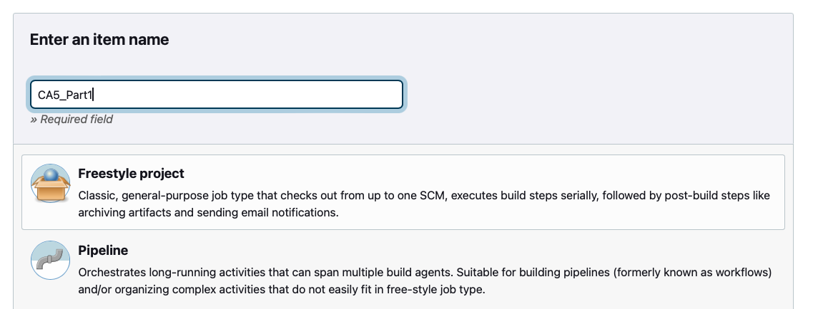

# CA5: Part1 README

### 0. Install jenkins
```bash
brew install jenkins-lts
```

### 1. Start jenkins
```bash
brew services start jenkins-lts
```

### 2. Edit the Jenkins Configuration File

1. Navigate to the directory returned by the previous command:
```bash
brew --prefix jenkins-lts
```

2. Navigate to the `Home` directory:
```bash
cd $(brew --prefix jenkins-lts)
```

3. Find the configuration file:
```bash
sudo nano homebrew.mxcl.jenkins-lts.plist
```

4. Inside the file, look for the line that defines the HTTP port (usually something like --httpPort=8080) and change it to --httpPort=9090. The line should look like this:
```bash
<string>--httpPort=9090</string>
```

### 3. Restart Jenkins
```bash
brew services restart jenkins-lts
```

### 4. Unlock jenkins

```bash
cat /Users/Bernardo/.jenkins/secrets/initialAdminPassword
```

### 5. Access Jenkins
1. Open a browser and navigate to `http://localhost:9090`


### 6. Creating a Pipeline

#### 6.1. Click on new Item

#### 6.2. Give the item a name and select the Pipeline option:



#### 6.3. In the Pipeline section of the setup, link the Pipeline to your git repository:

- 6.3.1. Change the Definition to Pipeline Script from SCM;
- 6.3.2. Change the SCM to git;
- 6.3.3. Input your own repository;
- 6.3.4. Save;


### 7. Create the Jenkinsfile

```groovy
pipeline {
    agent any

    stages {
        stage('Checkout') {
            steps {
                echo 'Checking out the code from the repository'
                git branch: 'main', url: 'https://github.com/BerAmorim/BerAmorim-devops-23-24-JPE-1110281.git'
            }
        }
        stage('Assemble') {
            steps {
                echo 'Assembling...'
                dir('CA2/Part1/gradle_basic_demo') {
                    sh 'chmod +x ./gradlew'
                    sh './gradlew clean assemble'
                }
            }
        }
        stage('Test') {
            steps {
                echo 'Testing...'
                dir('CA2/Part1/gradle_basic_demo') {
                    sh './gradlew test'
                    junit 'build/test-results/test/*.xml'
                }
            }
        }
        stage('Archive') {
            steps {
                echo 'Archiving...'
                dir('CA2/Part1/gradle_basic_demo') {
                    archiveArtifacts 'build/libs/*.jar'
                }
            }
        }
    }
}
```

#### 7.1. Push the changes to the remote directory!

### 8. Run the Pipeline

#### 9. Click the Build Now button:


## We are done with Part1 of the Assignment!