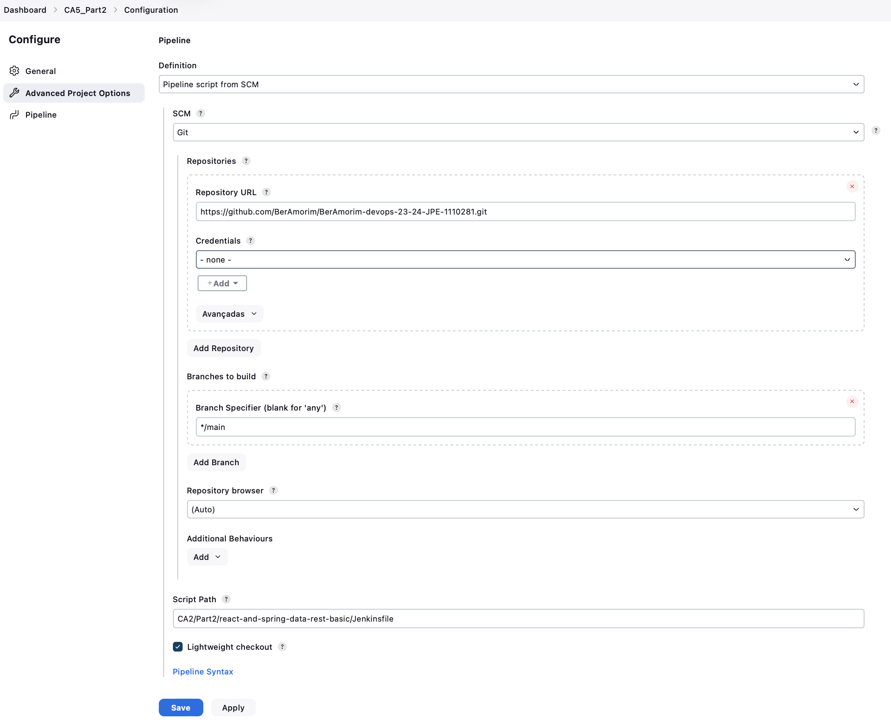
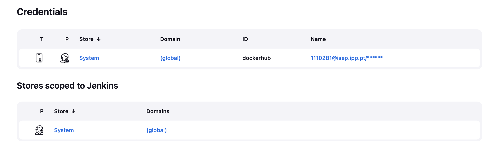
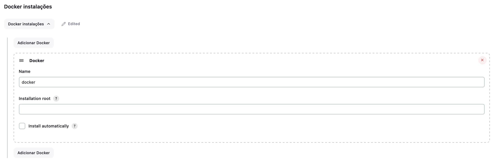
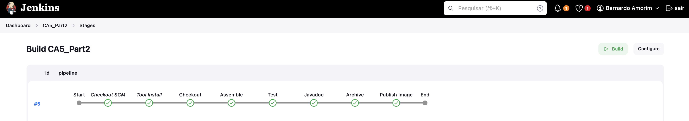

# CA5: Part2 README

The Readme is structure in 1 section:

- **Jenkins Steps**: This part of CA5 focuses on applying Continuous Integration and Delivery, by creating a pipeline in Jenkins to build the
  tutorial spring boot application (CA2/Part2 project);


# Setting Up and Running Jenkins in Docker

This guide explains how to set up and run Jenkins in Docker, including configuring a secure environment for Jenkins and Docker-in-Docker (DinD).

## Prerequisites

- Docker installed on your machine
- Internet access to download the necessary images

## Steps

### 1. Create a Docker Network

Create a Docker network to allow communication between Jenkins and Docker DinD containers.

```sh
docker network create jenkins
```

### 2. Run the Docker DinD Container

Run the Docker DinD container with the appropriate settings:

```sh
docker run \
  --name jenkins-docker \
  --rm \
  --detach \
  --privileged \
  --network jenkins \
  --network-alias docker \
  --env DOCKER_TLS_CERTDIR=/certs \
  --volume jenkins-docker-certs:/certs/client \
  --volume jenkins-data:/var/jenkins_home \
  --publish 2376:2376 \
  docker:dind \
  --storage-driver overlay2
```

### 3. Create a Dockerfile for Jenkins Blue Ocean

Create a `Dockerfile` to build a Jenkins image with the Blue Ocean plugin:

```Dockerfile
FROM jenkins/jenkins:2.452.2-jdk17

USER root

RUN apt-get update && apt-get install -y lsb-release
RUN curl -fsSLo /usr/share/keyrings/docker-archive-keyring.asc \
  https://download.docker.com/linux/debian/gpg

RUN echo "deb [arch=$(dpkg --print-architecture) \
  signed-by=/usr/share/keyrings/docker-archive-keyring.asc] \
  https://download.docker.com/linux/debian \
  $(lsb_release -cs) stable" > /etc/apt/sources.list.d/docker.list

RUN apt-get update && apt-get install -y docker-ce-cli

RUN jenkins-plugin-cli --plugins "blueocean docker-workflow"
```

### 4. Build the Jenkins Image

Build the Jenkins image with Blue Ocean plugin:

```sh
docker build -t myjenkins-blueocean:2.452.2-1 .
```

### 5. Run the Jenkins Container

Run the Jenkins container with the following settings:

```sh
docker run \
  --name jenkins-blueocean \
  --restart=on-failure \
  --detach \
  --network jenkins \
  --env DOCKER_HOST=tcp://docker:2376 \
  --env DOCKER_CERT_PATH=/certs/client \
  --env DOCKER_TLS_VERIFY=1 \
  --publish 8080:8080 \
  --publish 50000:50000 \
  --volume jenkins-data:/var/jenkins_home \
  --volume jenkins-docker-certs:/certs/client:ro \
  myjenkins-blueocean:2.452.2-1
```

### 6. Get the Initial Admin Password

Get the initial admin password to set up Jenkins:

```sh
docker exec jenkins-blueocean cat /var/jenkins_home/secrets/initialAdminPassword
```

### 7. Restart Jenkins Container (If Needed)

If you need to restart the Jenkins container:

```sh
docker restart jenkins-blueocean
```

## Summary

By following these steps, you will have a Jenkins instance running in Docker with Docker-in-Docker setup. You can now access Jenkins at `http://localhost:8080` and proceed with the initial setup using the admin password retrieved in step 6.


# 1. Creating a new Pipeline

### 1.1. Click on new Item

### 1.2. Give the item a name and select the Pipeline option

#### 1.3. In the Pipeline section of the setup, link the Pipeline to your git repository:

- 1.3.1. Change the Definition to Pipeline Script from SCM;
- 1.3.2. Change the SCM to git;
- 1.3.3. Input your own repository;
- 1.3.4. Save;



### 2. Create the Jenkinsfile

#### 2.1. Add the Javadoc stage

- 1. Install the Javadoc Plugin in Jenkins
- 2. Use the handy Snippet Generator to generate the script we need for the Jenkinsfile
- 3. Add the script to the jenkinsfile in a Javadoc stage

#### 2.2. Install the HTML Publisher plugin in Jenkins
-1. Install the HTML Publisher Plugin in Jenkins
-2. Use the handy Snippet Generator to generate the script we need for the Jenkinsfile
-3. Add the script to the jenkinsfile in a Javadoc stage


#### 2.3 Credentials

- 1. Add your DockerHub credentials to Jenkins
1. Go to Jenkins > Manage Jenkins > Credentials
2. Click on the Jenkins store
3. Click on Global credentials (unrestricted)
4. Click on Add Credentials
5. Fill in the details and save
6. Add the credentials to the Jenkinsfile



#### 2.4. Add the Docker tool

- 1. Go to Jenkins > Manage Jenkins > Tools


    
```groovy
pipeline {
  agent any
  tools {
    dockerTool 'docker'
  }
  environment {
    DOCKER_IMAGE = "beramorim/ca5_part2-image"
  }
  stages {
    stage('Checkout') {
      steps {
        echo 'Checking out the code from the repository'
        git branch: 'main', url: 'https://github.com/BerAmorim/BerAmorim-devops-23-24-JPE-1110281.git'
      }
    }
    stage('Assemble') {
      steps {
        echo 'Assembling...'
        dir('CA2/Part2/react-and-spring-data-rest-basic') {
          sh 'chmod +x ./gradlew'
          sh './gradlew clean assemble'
        }
      }
    }
    stage('Test') {
      steps {
        echo 'Testing...'
        dir('CA2/Part2/react-and-spring-data-rest-basic') {
          sh './gradlew test'
          junit 'build/test-results/test/*.xml'
        }
      }
    }
    stage('Javadoc') {
      steps {
        echo 'Generating Javadoc...'
        dir('CA2/Part2/react-and-spring-data-rest-basic') {
          sh './gradlew javadoc'
          javadoc javadocDir: 'build/docs/javadoc', keepAll: false
          publishHTML([allowMissing: false, alwaysLinkToLastBuild: false, keepAll: false, reportDir: 'build/docs/javadoc', reportFiles: 'index.html', reportName: 'HTML Report', reportTitles: 'CA2 Part2', useWrapperFileDirectly: true])
        }
      }
    }
    stage('Archive') {
      steps {
        echo 'Archiving...'
        dir('CA2/Part2/react-and-spring-data-rest-basic') {
          archiveArtifacts artifacts: 'build/libs/*.war', fingerprint: true
        }
      }
    }
    stage('Publish Image') {
      steps {
        echo 'Building and pushing Docker image...'
        dir('CA2/Part2/react-and-spring-data-rest-basic') {
          script {
            def appImage = docker.build("${env.DOCKER_IMAGE}:${env.BUILD_NUMBER}", ".")
            docker.withRegistry('https://registry.hub.docker.com', 'dockerhub') {
              appImage.push()
              echo "Built and pushed image with tag: ${env.DOCKER_IMAGE}:${env.BUILD_NUMBER}"
            }
          }
        }
      }
    }
  }
}
```
Push the changes and run the pipeline!



## We are done with Part2 of the Assignment!
